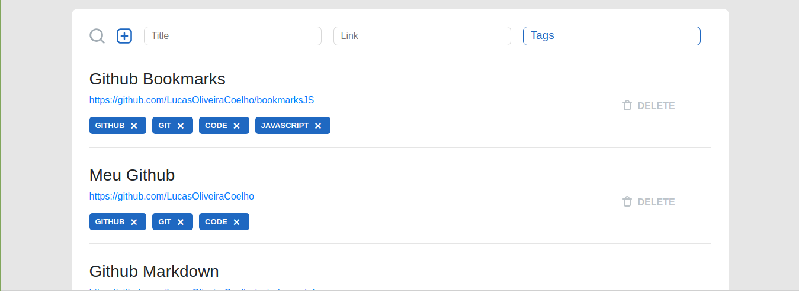

# Estudo de markdown

## Indice
- [Título](https://github.com/LucasOliveiraCoelho/estudo-markdown#título)
- [Negrito](https://github.com/LucasOliveiraCoelho/estudo-markdown#negrito)
- [Itálico](https://github.com/LucasOliveiraCoelho/estudo-markdown#itálico)
- [Itálico + Negrito](https://github.com/LucasOliveiraCoelho/estudo-markdown#itálico--negrito)
- [Riscar palavra](https://github.com/LucasOliveiraCoelho/estudo-markdown#riscar-palavra)
- [Criar linha horizontal](https://github.com/LucasOliveiraCoelho/estudo-markdown#criar-linha-horizontal)
- [Listas não ordenadas](https://github.com/LucasOliveiraCoelho/estudo-markdown#listas-não-ordenadas)
- [Listas ordenadas](https://github.com/LucasOliveiraCoelho/estudo-markdown#listas-ordenadas)
- [Links](https://github.com/LucasOliveiraCoelho/estudo-markdown#links)
- [Imagens](https://github.com/LucasOliveiraCoelho/estudo-markdown#imagens)
- [Tabelas](https://github.com/LucasOliveiraCoelho/estudo-markdown#tabelas)
- [Códigos](https://github.com/LucasOliveiraCoelho/estudo-markdown#códigos)

## Título

Parágrafo normal com um texto normal, sendo exibido automaticamente enquanto *digita*.
- Teste
- Teste
- Teste

> Bloco de citação

```
Bloco de código
```

## Negrito
Para utilizar o **negrito** insira 2 * no começo e no final ou __dois__ _

## Itálico
Para utilizar o ___Itálico___ insira 3 * no começo e no final ou ***dois*** .

## Itálico + Negrito
Para utilizar o __*Itálico + Negrito*__ insira 2 * e 1 _ no começo e no final ou **_dois_** * e um _ .

## Riscar palavra
~~Palavras ficam~~ riscadas ao colocar 2 vezes ~ no começo e no final da palavra.

## Criar linha horizontal
_ _ _
Texto na parte superior da linha
****************************************
Texto na parte inferior
________________________________________

## Listas não ordenadas

### Lista 1
* Item 1
* Item 2
* Item 3

### Lista 2
+ Item 1
+ Item 2
+ Item 3

### Lista 3
- Item 1
- Item 2
- Item 3

### Lista 4
- Item 1
   - Sub item
   * Sub item
   + Sub item

- Item 2

- Item 3

## Listas ordenadas

### Lista 1
1. Item 1
2. Item 2
3. Item 3

### Lista 2
4. Item 1
9. Item 2
1. Item 3

### Lista 3
1994\. Brasil  
1998\. França  
2002\. Brasil  

## Links

### Link 1
[Clique aqui](https://github.com/LucasOliveiraCoelho)

### Link 2
[Acesse meu github](https://github.com/LucasOliveiraCoelho "Meu github")

### Link 3
[Meu github][github-url]

[github-url]:https://github.com/LucasOliveiraCoelho


[Hello, world!](http://example.com/){target="_blank"}

## Imagens

Desenvolvimento do front end de uma aplicação de bookmarks utilizando React.js


Tela de adicionar

[![Imagem filter][imagem-filtro]][github-url]
Tela de filtro

[imagem-filtro]: imagens/search.png

## Tabelas
Exemplo de tabelas:

Nome alinhada a esquerda, idade centralizada e profissão alinhada a direita.

| Nome | Idade | Profissão | 
| :---- | :---: | ---------: |
| Carlos |  18  | Programador C# |
| Lucas  |  20  | Desenvolvedor de jogos |
| Ricardo |  32  | Programador PHP |

## Códigos

### Exemplo em linha
Exemplo de código somente em uma `palavra.` sinalizando que essa palavra é código.
#### Javascript código exemplo
``const mensagem = `Meu nome é {nome}`; ``

### Exemplo em bloco 1
Bloco utilizando 3 crase.
```javascript
const username = 'LucasCoelho'
const password = '********'
// achou que ia ter a senha né ? achou errado!

login(username,password)
```

### Exemplo em bloco 2
Bloco utilizando tabulações

    const username = 'LucasCoelho'
    const password = '********'
    // achou que ia ter a senha né ? achou errado!

    login(username,password)
